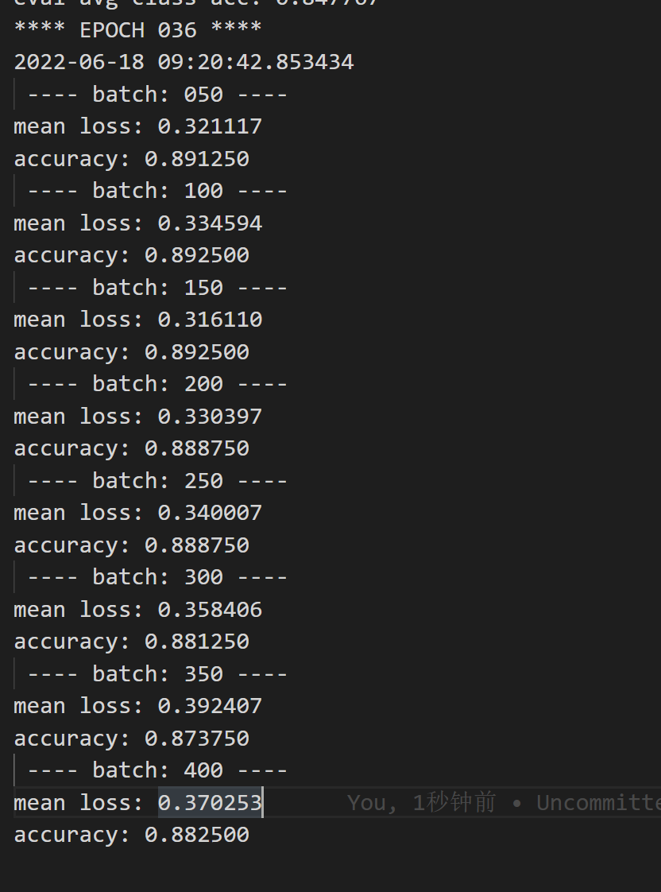

# 基于PointNet项目 对KNN实现进行CUDA的进一步支持

> 原始README见 [`README_ORIGIN.md`](./README_ORIGIN.md)

对Pointnet中的KNN实现进行了进一步的CUDA支持

源代码实现为 (进行了二次注释)
```python
def knn_point(k, xyz1, xyz2):
    '''
    Input:
        k: int32, number of k in k-nn search
        xyz1: (batch_size, ndataset, c) float32 array, input points
        xyz2: (batch_size, npoint, c) float32 array, query points
    Output:
        val: (batch_size, npoint, k) float32 array, L2 distances
        idx: (batch_size, npoint, k) int32 array, indices to input points
    '''
    b = xyz1.get_shape()[0].value
    n = xyz1.get_shape()[1].value
    c = xyz1.get_shape()[2].value
    m = xyz2.get_shape()[1].value
    print b, n, c, m  
    '''
    b = batch_size
    n = ndataset
    c = 3
    m = npoint
    '''
    print xyz1, (b,1,n,c)
    xyz1 = tf.tile(tf.reshape(xyz1, (b,1,n,c)), [1,m,1,1])
    xyz2 = tf.tile(tf.reshape(xyz2, (b,m,1,c)), [1,1,n,1])
    '''
    xyz1:(batch_size,m,n,3)
    xyz2:(batch_size,m,n,3)

    '''
    dist = tf.reduce_sum((xyz1-xyz2)**2, axis=-1) #按照最后一个维度求和 即求出的是欧式距离平方 
    #dist :(batch_size,m,n)
    print dist, k
    outi, out = select_top_k(k, dist)# 此处调用了cuda/自定义opkernal实现的一个选择排序
    idx = tf.slice(outi, [0,0,0], [-1,-1,k])
    val = tf.slice(out, [0,0,0], [-1,-1,k])
    print idx, val
    #val, idx = tf.nn.top_k(-dist, k=k) # ONLY SUPPORT CPU
    return val, idx
```

### 源代码分析与编写
其中，该代码段先是待带查询的点（xyt2）与已知点（xyz1），求出所有两两对应的欧氏距离的平方（dist），这部分是调用了tf的自带函数,`tf.tile`,`tf.reducesum`,`tf.slice`，然后利用CUDA的实现的在batch内的选择排序进行计算。
我们期望能够将整个knn_point改写为一个kernal算子。

1. 首先在一个batch内 可以通过共享变量的方式 *[1]

```c
    __shared__ int point_index[m][n];
    __shared__ float point_val[m][n]; 
```
将输入的所有点位置信息计算并存储 。

2. 然后进行k次选择排序，并将结果记录进输出变量指针指向的区域。
```c
    for (int s=0;s<k;++s) {
            int min=s; 
            …………
            //最后将结果写入输出变量
            p_dist[s] = point_val[j][s];
            outi[j*n+s] = point_index[j][min];
        }
```
这便完成了cuda的编写

3.然后是进行tensorflow自定义算子的注册.通过继承tensorflow的自定义类`void KnnKernalGpuOp:public OpKernel`，并重写构造函数与`Compute`方法,在该方法内应调用cuda的接口函数
```c
    void knn_gpu(int b,int n,int m,int k,const float * xyz1,const float * xyz2,float * outi,float *out)
    {
        knn_kernal_gpu<<<b,256>>>(b,n,m,k,xyz1,xyz2,outi,out);
    }
```
4.还应当注册该自定义算子 *[2]
```c
    REGISTER_KERNEL_BUILDER(Name("KnnKernal").Device(DEVICE_GPU),KnnKernalGpuOp);
```

5.对内存存储的优化
通过观察,我们只需要对一次排序后的进行一次记录即可，通过循环合并的方式将原先的`__shared__`变量转化为Thread内的两个数组，暂定长度为512.`const int NN =512;` 但此部分存疑。不知道n的长度是否会大于512


## 测试通过
### 算子模拟输出

```shell
root@893060c85290:~/volume/back/pointnet2/tf_ops/grouping# python tf_grouping.py        
2022-06-18 04:49:43.257888: W tensorflow/core/platform/cpu_feature_guard.cc:45] The TensorFlow library wasn't compiled to use SSE4.1 instructions, but these are available on your machine and could speed up CPU computations.
…………警告信息略
2022-06-18 04:49:43.782944: I tensorflow/core/common_runtime/gpu/gpu_device.cc:940] Found device 0 with properties: 
name: NVIDIA GeForce GTX 1080 Ti
major: 6 minor: 1 memoryClockRate (GHz) 1.582
pciBusID 0000:04:00.0
Total memory: 10.92GiB
Free memory: 10.78GiB
2022-06-18 04:49:43.782978: I tensorflow/core/common_runtime/gpu/gpu_device.cc:961] DMA: 0 
2022-06-18 04:49:43.782986: I tensorflow/core/common_runtime/gpu/gpu_device.cc:971] 0:   Y 
2022-06-18 04:49:43.783000: I tensorflow/core/common_runtime/gpu/gpu_device.cc:1030] Creating TensorFlow device (/gpu:0) -> (device: 0, name: NVIDIA GeForce GTX 1080 Ti, pci bus id: 0000:04:00.0)
3.59817123413
(32, 512, 64, 64) float32
[[[[ 0.54340494  0.2783694   0.4245176  ...,  0.59280539  0.62994188
     0.14260031]
   [ 0.93384129  0.9463799   0.60229665 ...,  0.49216697  0.40288034
     0.35429829]
   [ 0.50061435  0.44517663  0.09043279 ...,  0.2529805   0.07957344
     0.73276061]
   ..., 
   [ 0.5890246   0.65399295  0.00466393 ...,  0.99648553  0.39457497
     0.99294263]
   [ 0.91142356  0.82755733  0.83824414 ...,  0.33595636  0.53248352
     0.18427104]
   [ 0.96018976  0.16091193  0.79455757 ...,  0.26099724  0.81464601
     0.46446744]]

 ………… 省略后面输出
```
### 运行测试
在运行至 36 epoch时，accuracy 接近88% 基本可以说明算法实现的正确性

## 注意/TODO
[1] 这里其实不需要用`__share__`关键字来分配变量，因为本算法在不同Block和不同Thread中的操作并不会相互影响，不存在数据相关。所以可以使用本地变量存储，或能进一步提高效率。但考虑到索引方便，暂时如此。后续优化见[源代码](#源代码分析与编写) 步骤5

[2] 注意，此处的Name参数将决定在python中调用cuda的函数名。此处一般为驼峰命名，但在调用时应使用蛇形命名来调用（以符合 PEP8）。详细说明见[官方文档](https://www.tensorflow.org/guide/create_op?hl=zh-cn)

[3] 自定义算子函数在传参时要注意顺序，作为Attr的标量参数应放在最后